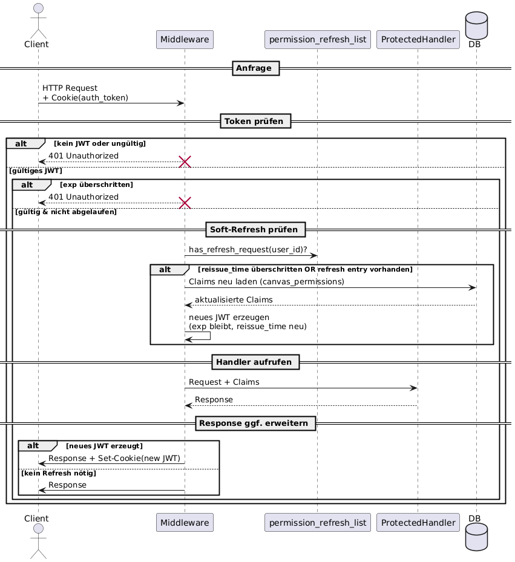
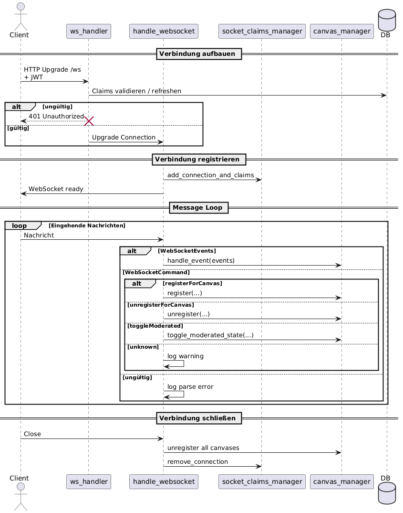
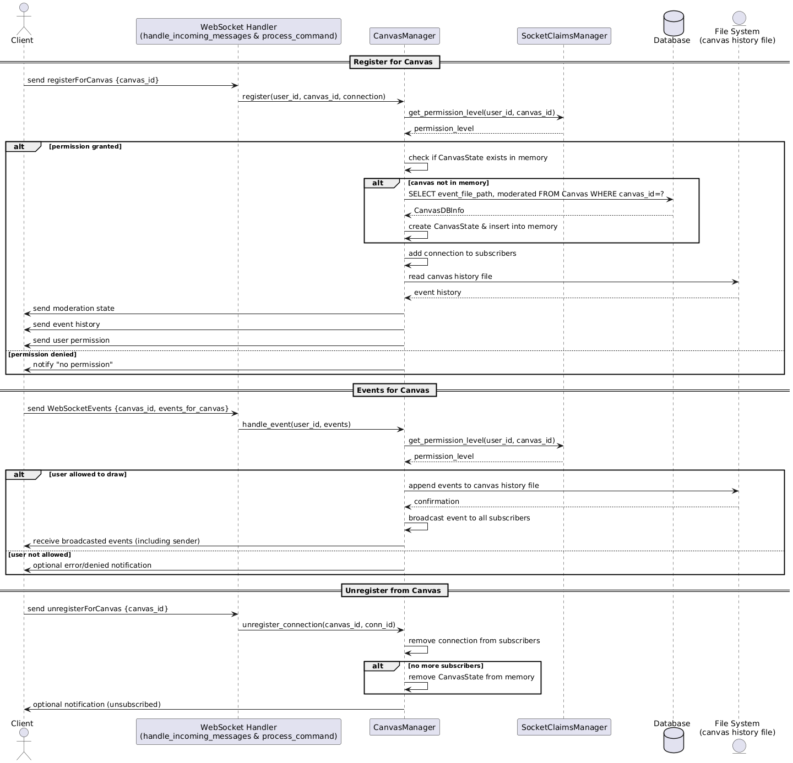
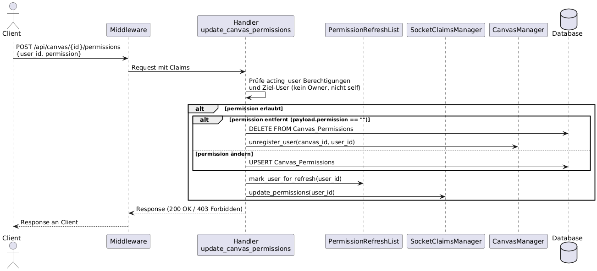

# Einleitung

Diese Dokumentation beschreibt die Architektur einer Multi-User-Zeichen-Webapplikation.
Sie umfasst das **Frontend** (TypeScript), das **Backend** (Rust/Axum) sowie die **Datenpersistenz** (SQLite + Dateisystem) und erläutert die wichtigsten Abläufe und Designentscheidungen.
Abschließend werden Abweichungen von der Aufgabenstellung begründet.


# Frontend-Dokumentation

## Übersicht

Das Frontend der Anwendung ist in **TypeScript** implementiert und nutzt ein eigenes Build-Skript, um die Dateien für die Auslieferung vorzubereiten.  
Die Struktur orientiert sich an klassischen Webprojekten mit Trennung von **Quellcode**, **statischen Ressourcen** und **Build-Konfiguration**.

---

## Ordnerstruktur

### `/public`

Enthält alle statischen Dateien, die **nicht kompiliert** werden müssen.

* **index.html**  
  Einstiegspunkt der Single Page Application.
  * Lädt globale und seiten-spezifische Stylesheets (`base.css`, `login.css`, `register.css`, `home.css`, `canvas.css`)
  * Grundstruktur (Header und Main-Container):
  * Bindet das kompilierte Frontend-Skript `main.js` als ES-Module ein.

* **/styles**  
  CSS-Dateien, aufgeteilt nach Bereichen der Anwendung

> Alle Dateien in `frontend/public` werden unverändert in den `/public`-Ordner kopiert.

---

### `/src`

* **main.ts**  
  Einstiegspunkt der App. Initialisiert die Anwendung und bindet das Client-Side-Routing ein.

* **router.ts**  
  Client-Side-Routing:
  * `handleRoute()` prüft `window.location.pathname` und rendert die passende Seite:
    * `/login` → Login-Seite
    * `/register` → Registrierungsseite
    * `/canvas/:id` → Zeichenfläche (nur für eingeloggte Nutzer)
    * `/` → Startseite oder Login (abhängig vom Auth-Status)
    * alles andere → Weiterleitung auf `/`
  * `navigateTo(path)` aktualisiert die Browser-URL (`history.pushState`) und rendert die Zielseite neu.

* **api.ts**  
  Bündelt REST-API-Aufrufe für:
  * Authentifizierung (Login, Logout, Registrierung)
  * Benutzerverwaltung
  * Canvas-Verwaltung (Listen, Erstellen, Berechtigungen)  
    > Echtzeit-Synchronisation über WebSockets läuft separat und wird nicht über `api.ts` abgewickelt.

* **/pages**  
  Enthält die **Views** der Anwendung. Jede Seite exportiert eine `renderXYZPage()`-Funktion, die:
  * den Inhalt von `<div id="app">` ersetzt
  * die benötigten DOM-Elemente erstellt
  * Event-Handler mit der API verbindet

  * **canvas.ts**  
    Render-Funktion für die Zeichen-Seite.
    * Baut das Grundlayout auf (`<canvas>`, Tools-Bereich, Moderation, Berechtigungen)
    * Lädt dynamisch die Zeichen-Logik aus `/drawer`
    * Enthält Logik für Berechtigungs-Management (Lesen, Schreiben, Moderation etc.)

  * **drawer/**  
    Enthält die komplexe Zeichen- und Tool-Logik.

---

## `/src/pages/drawer`

Diese Komponenten steuern die **Zeichenlogik, Shape-Verwaltung und Backend-Synchronisation**.

### Architekturüberblick

* **Event Flow**
  1. Nutzer interagiert mit der Zeichenfläche → **ShapeFactories** (Tools wie Linie, Rechteck, Auswahl) erhalten Events
  2. ShapeFactories rufen Methoden auf **ShapeManager** auf (`add/remove/replace shapes`)
  3. ShapeManager erzeugt Events und wendet sie über das **EventSystem** an
  4. **BackendSync** ist als Handler im EventSystem registriert → sendet Events an den Server
  5. Events vom Backend werden direkt auf die **Canvas** angewendet

* **Shape Storage**
  * Shapes werden in der **Canvas** über eine **LinkedListMap** gespeichert
    * LinkedList ermöglicht effizientes Reordering (front/back)
    * HashMap erlaubt direkten Zugriff auf Shapes per ID
  * Implementierung in `LinkedListMap.ts`

* **Functional Shapes**
  * Shapes (`Line`, `Rectangle`, etc.) sind **immutable**
  * Vereinfacht die **Event-Sourcing**-Logik

* **Context Menu**
  * Implementiert in `menuApi.ts`
  * Ermöglicht Änderungen an Farbe, Z-Order und weiteren Shape-Optionen
  * Entspricht der Lösung aus A2.3

* **Backend Synchronisation**
  * `BackendSync.ts` verwaltet WebSocket-Verbindungen
  * Sendet lokale Events aus dem EventSystem an den Server
  * Wendet Remote-Events direkt auf die Canvas an
  * Steuert Moderation, Benutzerrechte und Editierbarkeit der Canvas

---

# Backend-Dokumentation

Das Backend ist in **Rust** mit **Axum** implementiert.

---

## Projektstruktur (Backend)

| Datei                        | Zweck |
|------------------------------|-------|
| **main.rs**                  | Einstiegspunkt der App. Baut DB-Verbindung auf, initialisiert App-State und definiert Routing. |
| **auth.rs**                  | Definition der User-Claims (JWT-Inhalt), Utilities und Middleware für Authentifizierung. |
| **permission_refresh_list.rs** | Serverseitige `HashMap<UserId, Timestamp>` zur Verwaltung von Nutzern, deren JWTs aktualisiert werden müssen. |
| **handlers.rs**              | HTTP-Handler für alle normalen Routen (außer WebSockets). |
| **websocket_handlers.rs**    | Handler für eingehende WebSocket-Nachrichten und -Kommandos. |
| **identifiable_web_socket.rs** | Wrapper für WebSockets, damit sie als Keys in Maps nutzbar sind. |
| **canvas_manager.rs**        | Verwaltung aktiver Zeichenflächen: Registrierung, Broadcasting, Event-Speicherung, Moderationszustand. |
| **socket_claims_manager.rs** | Verwaltung der Claims aller aktiven WebSockets. |


---

## Routen

* `/` → GET → statische Dateien für das Frontend
* `/ws` → GET → Aufbau einer WebSocket-Verbindung
* `/api`
  * `/login` → POST → Nutzer einloggen
  * `/logout` → POST → Nutzer ausloggen
  * `/register` → POST → neuen Nutzer anlegen
  * `/me` → GET (JWT-geschützt) → eigene Infos abrufen
  * `/user/update` → POST (JWT-geschützt) → E-Mail oder Display-Namen ändern
  * `/canvases/create` → POST (JWT-geschützt) → neuen Canvas anlegen
  * `/canvases/list` → GET (JWT-geschützt) → alle berechtigten Canvases
  * `/canvas/{id}/permissions`
    * GET (JWT-geschützt) → Liste der Berechtigungen
    * POST (JWT-geschützt) → Berechtigung für einen User setzen

---

## Middleware & JWT Handling

JWTs enthalten:
- `user_id`
- `email`
- `display_name`
- `canvas_permissions`
- `exp` (harte Ablaufzeit)
- `reissue_time` (Soft-Refresh-Zeit)

### Ablauf

1. **Tokenprüfung**
   - Middleware extrahiert `auth_token` aus Cookies
   - JWT wird verifiziert
   - Falls ungültig oder `exp` abgelaufen → `401 Unauthorized`

2. **Soft-Refresh**
   - Falls `reissue_time` erreicht oder `permission_refresh_list`-Eintrag existiert → Claims aus DB aktualisieren
   - Nur `canvas_permissions` ändern sich serverseitig
   - Neues JWT wird mit gleichem `exp`, aber neuer `reissue_time` erzeugt
   - JWT wird als `Set-Cookie` zurückgegeben

3. **Weitergabe**
   - Claims in den Request-Kontext geschrieben
   - Handler nutzt aktuelle Claims

4. **Response**
   - Falls neues JWT erzeugt → im `Set-Cookie`-Header enthalten



---

## WebSockets

* Aufbau:
  - Client ruft `/ws` auf und liefert gültiges JWT
  - Falls Refresh nötig → Claims aus DB aktualisiert
  - Falls JWT abgelaufen → `401 Unauthorized`
  - Upgrade auf WebSocket
  - Socket wird zu `IdentifiableWebSocket` gewrapped
  - Registrierung im `socket_claims_manager`

* Message Handling:
  - Eingehende Nachrichten werden geparst
  - Abhängig vom Typ:
    * **Events** → an `canvas_manager`
    * **Commands** (subscribe/unsubscribe/toggleModerated) → ausgeführt
  - Ungültige Nachrichten → ignoriert und geloggt

* Aufräumen bei Verbindungsende:
  - Deregistrierung aus allen Canvases
  - Entfernung aus `socket_claims_manager`




---

# Datenpersistenz

Die Anwendung verwendet für persistente Daten eine Kombination aus **SQLite** und **Dateispeicherung**.

## Struktur

- **Benutzerdaten & Zeichenflächen-Metadaten**  
  Werden in einer SQLite-Datenbank im Verzeichnis `/data` gespeichert.

- **Event-Historie der Zeichenflächen**  
  Für jede Zeichenfläche existiert eine eigene Datei im Verzeichnis `/data/canvases`.  
  Diese enthält die komplette Event-Historie, sodass eine Canvas jederzeit wiederhergestellt werden kann.

## SQL-Schema

Das Schema ist in `/migrations` definiert.

### `users`

```sql
CREATE TABLE users (
    user_id INTEGER PRIMARY KEY AUTOINCREMENT,
    email TEXT NOT NULL UNIQUE,
    password_hash TEXT NOT NULL,
    display_name TEXT NOT NULL,
    created_at DATETIME DEFAULT CURRENT_TIMESTAMP
);
```

### `Canvas`

```sql
CREATE TABLE Canvas (
    canvas_id TEXT PRIMARY KEY NOT NULL, -- UUID oder SHA1 Hash
    name TEXT NOT NULL DEFAULT 'Untitled Canvas', -- Benutzerfreundlicher Name
    owner_user_id INTEGER NOT NULL, -- Referenz auf den Besitzer
    moderated BOOLEAN NOT NULL DEFAULT FALSE, -- Moderationszustand
    event_file_path TEXT NOT NULL DEFAULT '', -- Pfad zur Event-Datei

    FOREIGN KEY (owner_user_id) REFERENCES users(user_id) ON DELETE CASCADE
);

```

### `Canvas_Permissions`

```sql
CREATE TABLE Canvas_Permissions (
    user_id INTEGER NOT NULL,
    canvas_id TEXT NOT NULL,
    permission_level TEXT NOT NULL, -- 'R', 'W', 'V', 'M', 'O', 'C'

    PRIMARY KEY (user_id, canvas_id),
    FOREIGN KEY (user_id) REFERENCES users(user_id) ON DELETE CASCADE,
    FOREIGN KEY (canvas_id) REFERENCES Canvas(canvas_id) ON DELETE CASCADE,

    CHECK (permission_level IN ('R', 'W', 'V', 'M', 'O', 'C'))
);

CREATE INDEX idx_canvas_permissions_canvas_id 
    ON Canvas_Permissions(canvas_id);
```

### Permission Levels

* **R** – Read
* **W** – Write
* **V** – Write even when moderated
* **M** – Moderate
* **O** – Owner
* **C** – Co-Owner


# Weitere relevante Vorgänge

In diesem Abschnitt werden komplexere Abläufe der Anwendung anhand von **Sequenzdiagrammen** dargestellt. Sie verdeutlichen, wie einzelne Komponenten zusammenarbeiten und welche Schritte bei zentralen Prozessen ablaufen.







---

# Anwendung starten

Die Anwendung kann auf zwei Arten gestartet werden: entweder mit **Docker** oder direkt lokal über **Cargo** und **npm**.

## Start mit Docker

Zum Bauen und Starten des Containers:

```sh
docker-compose up --build
# oder
docker compose up --build
```

## Start ohne Docker

1. **Frontend bauen**

```sh
cd frontend
npm run build
cd ..
```

2. **SQLx-CLI installieren** (falls nicht vorhanden)

```sh
cargo install sqlx-cli --features sqlite
```

3. **Datenbank einrichten**

```sh
sqlx database setup
```

4. **Webserver starten**

```sh
JWT_SECRET=your_secret_here cargo run
```

## Zugriff auf die Anwendung

Nach dem Start ist die Anwendung unter folgender URL erreichbar:
👉 [http://localhost:8080](http://localhost:8080)

## Server stoppen

Mit `CTRL + C` im Terminal.


---

# KI-Nutzung

Ich habe ChatGPT und Google Gemini für Research, Programmierung und das Erstellen der Dokumentation genutzt.
Als Ausgangspunkt habe ich den Code aus [https://github.com/tokio-rs/axum/blob/main/examples/jwt/src/main.rs](https://github.com/tokio-rs/axum/blob/main/examples/jwt/src/main.rs) verwendet.
